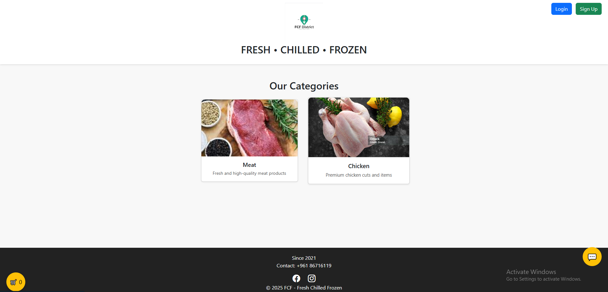
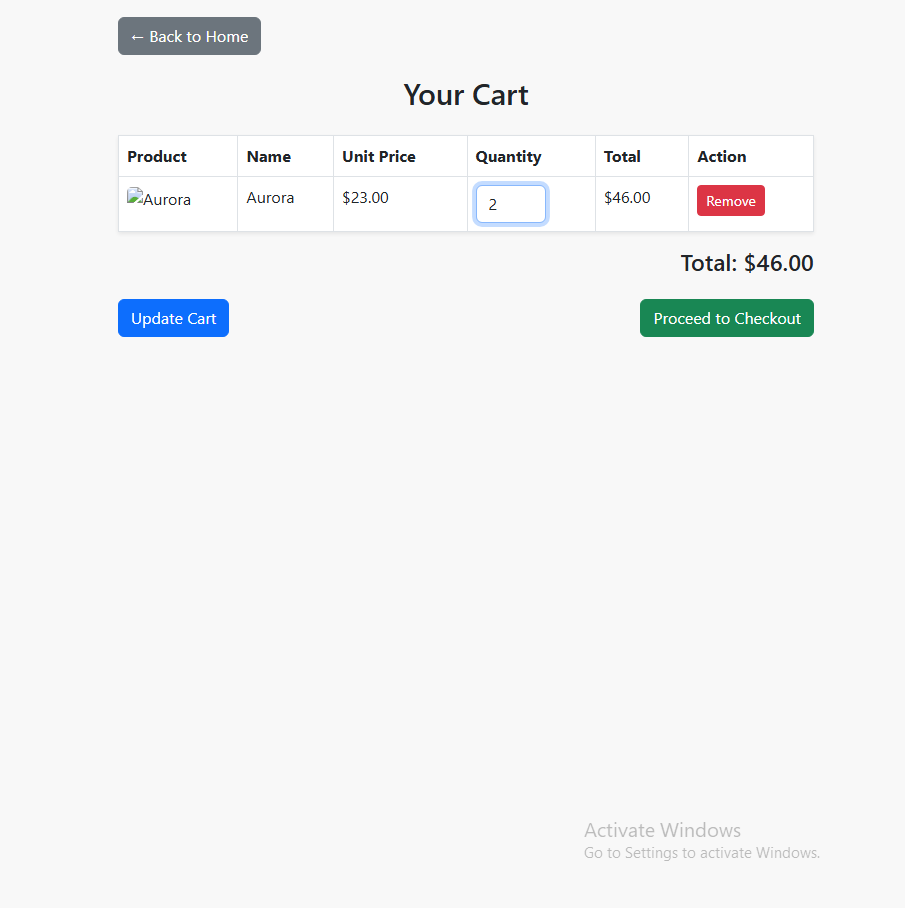
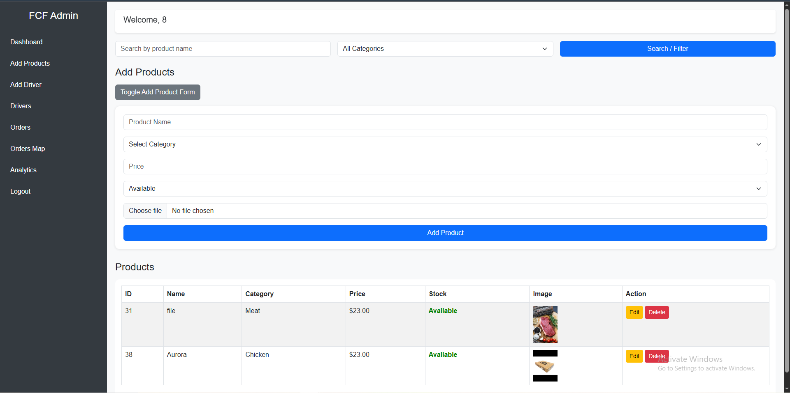
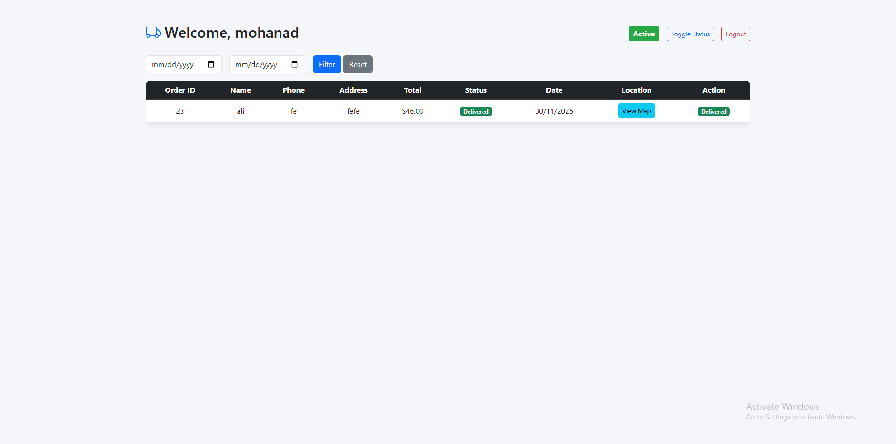
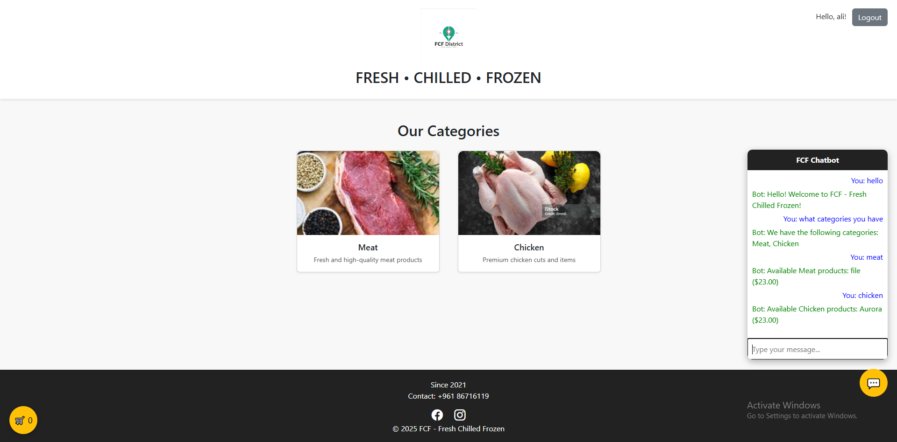
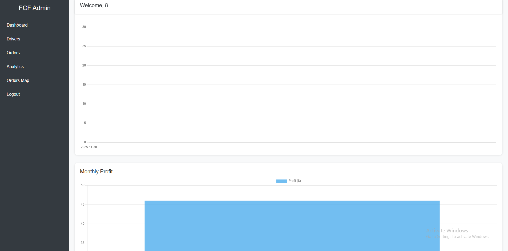

# FCF Project

Full-Stack Web Application for product and order management.  
Built with PHP and Laravel, using REST APIs for backend operations.  
Includes an **offline JavaScript chatbot** for interactive user assistance.  
Supports driver assignment, delivery tracking via map, and analytics.  
Designed with potential AI/IoT integration in mind (e.g., smart routing and delivery optimization).

---

## Features

### User Features
- Browse products and categories
- Add products to cart
- Checkout orders with:
  - Name, Email, Phone, Delivery Address
  - Cart summary: Product Name, Unit Price, Quantity, Total
  - Total amount calculation
- **Offline JavaScript chatbot** for instant assistance
- reset password after 3 filed attempts to login

### Admin Dashboard
- **Product Management**
  - Search by name or category
  - Add new products with name, category, price, availability, and photo
- **Driver Management**
  - View driver list: Name, Status (Active/Inactive), Assigned Orders, Delivered Orders
  - Add new drivers
- **Order Management**
  - View all orders with customer info, total, status, assigned driver, and admin actions
  - Assign drivers to orders
- **Analytics Page**
  - Track orders, sales, and driver performance

### Driver Page
- View assigned orders:
  - Order ID, Customer Name, Phone, Address, Total, Status, Date
- Map showing **delivery locations and current location** using Leaflet/OpenStreetMap
- Mark orders as delivered
- Real-time overview of tasks for each driver
- Personalized welcome message (e.g., "Welcome, Mohanad")

---

## Technologies Used
- PHP, Laravel  
- MySQL (Database)  
- REST APIs  
- HTML, CSS, JavaScript (chatbot, map, cart)  
- Leaflet / OpenStreetMap for delivery tracking  

---

## How to Run
1. Clone the repository: `git clone https://github.com/USERNAME/fcf_proj.git`  
2. Install dependencies: `composer install`  
3. Configure `.env` file with database credentials  
4. Run Laravel server: `php artisan serve`  
5. Open browser at `http://localhost:8000`  

---

## Screenshots
  
*Homepage showing product catalog*

  
*Cart page with order summary and checkout*

  
*Admin managing products, drivers, and orders*

  
*Driver page with assigned orders and map tracking*

  
*Offline JavaScript chatbot interaction*

  
*Order and sales analytics page for admins*

---

